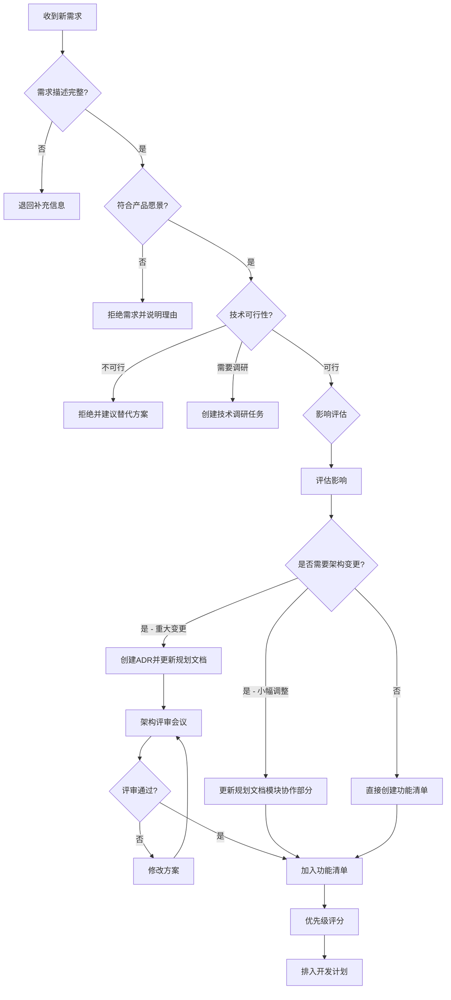

# Vibe 需求评审决策树



## 决策标准详解

### Q1: 需求描述完整性检查
**必填项检查清单**:
- [ ] 用户故事描述清晰
- [ ] 问题陈述明确
- [ ] 至少有2条可验证的验收标准
- [ ] 影响范围已预估

**不完整处理**: 自动退回给需求提出人，附带缺失项清单

---

### Q2: 产品愿景一致性检查
**评估问题**:
1. 这个需求是否符合Vibe的核心定位？
2. 是否与现有功能产生冲突或重叠？
3. 是否会引入不必要的复杂性？（KISS原则）
4. 是否是"当前真正需要的"还是"未来可能需要的"？（YAGNI原则）

**拒绝理由模板**:
```
感谢您的建议！经过评估，此需求暂不符合Vibe当前的产品定位，原因如下：
- [具体原因1]
- [具体原因2]

建议的替代方案：[如果有]
```

---

### Q3: 技术可行性评估
**评估维度**:
| 维度 | 评估问题 | 结论 |
|------|---------|------|
| 技术栈兼容性 | 是否需要引入新技术栈？是否与现有技术冲突？ | 兼容/需调研/不兼容 |
| 性能影响 | 是否会显著影响系统性能？ | 无影响/可优化/需架构调整 |
| 安全风险 | 是否引入新的安全风险？ | 无风险/可控/高风险 |
| 第三方依赖 | 是否依赖不稳定的第三方服务？ | 无依赖/稳定依赖/不稳定依赖 |
| 团队能力 | 团队是否具备实现该需求的技术能力？ | 可实现/需学习/超出能力 |

**决策规则**:
- 任一维度为"不兼容/高风险/超出能力" → 拒绝需求
- 2个及以上维度为"需调研/需学习" → 创建技术调研任务，暂缓评审
- 其他情况 → 进入影响评估

---

### Q4-Q5: 影响评估与架构判断
**架构变更判断标准**:

#### 🔴 重大架构变更 (需创建ADR + 评审会议)
符合以下任一条件：
- 新增核心模块（如认证系统、支付模块）
- 变更模块间通信方式（如从REST改为消息队列）
- 引入新的技术栈或框架（如新增GraphQL层）
- 数据库架构重大调整（如分库分表、数据迁移）
- 影响3个及以上现有模块的交互方式

#### 🟡 小幅架构调整 (更新规划文档)
符合以下任一条件：
- 在现有模块中新增子模块
- 新增API端点但不改变现有接口
- 数据库新增表但不修改现有表结构
- 影响1-2个模块的局部调整

#### 🟢 无架构影响 (直接进入功能清单)
- 纯UI调整
- Bug修复
- 性能优化（不改变架构）
- 文案/配置修改

---

### 优先级评分矩阵

**评分公式**:
```
优先级分数 = (业务价值 × 3) + (用户影响 × 2) + 紧急程度 - (实现复杂度 × 0.5) - (技术风险 × 0.5)
```

**评分表**:
| 维度 | 1分 | 3分 | 5分 | 权重 |
|------|-----|-----|-----|------|
| 业务价值 | 可有可无 | 有一定价值 | 核心业务关键 | ×3 |
| 用户影响 | <5%用户 | 5-30%用户 | >30%用户 | ×2 |
| 紧急程度 | 可延后 | 本季度需要 | 立即需要 | ×1 |
| 实现复杂度 | 简单(1-2天) | 中等(3-5天) | 复杂(>5天) | ×(-0.5) |
| 技术风险 | 低风险 | 中等风险 | 高风险 | ×(-0.5) |

**优先级分级**:
- **P0 (关键路径)**: 分数 ≥ 20，阻塞其他功能或严重影响用户体验
- **P1 (高优先级)**: 分数 15-19，重要但不紧急
- **P2 (正常优先级)**: 分数 10-14，常规功能需求
- **P3 (低优先级)**: 分数 < 10，优化类需求

---

## 需求评审输出物

### 通过评审的需求
自动生成以下内容：

1. **功能清单条目** (自动填充)
   ```markdown
   ## Feature-XXX: [需求标题]
   - 优先级: P0/P1/P2/P3
   - 来源: REQ-YYYY-MM-NNN
   - 架构影响: 重大/小幅/无
   ```

2. **架构决策记录** (如适用)
   ```markdown
   # ADR-XXX: [决策标题]
   日期: YYYY-MM-DD
   状态: 提议中/已接受/已废弃

   ## 背景
   [需求背景]

   ## 决策
   [选择的方案]

   ## 影响
   - 模块变更: [...]
   - 技术栈变更: [...]
   - 迁移成本: [...]

   ## 替代方案
   - 方案A: [优缺点]
   - 方案B: [优缺点]
   ```

3. **规划文档更新PR** (如适用)
   - 自动创建PR，标题格式: `[Planning] Add module XXX for Feature-XXX`
   - 需要架构负责人Review

### 被拒绝的需求
记录到 `rejected-requirements.md`，包含：
- 需求编号
- 拒绝原因
- 拒绝日期
- 建议的替代方案（如有）

用于避免重复讨论相同需求。
