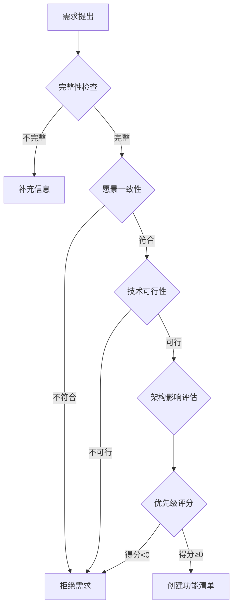

# Vibe 技术规范

> **版本**: v1.0
> **最后更新**: 2026-01-09
> **适用范围**: Vibe项目所有开发活动

---

## 📌 1. 目的与范围

### 1.1 文档目的

本规范定义了Vibe项目的：
- **开发流程**：从需求到代码合并的完整流程
- **文档体系**：核心文档的使用方法和维护规则
- **质量标准**：代码质量、测试、安全的最低要求
- **协作规范**：团队协作和文档同步机制

### 1.2 适用范围

- ✅ **包含**：需求评审、规划设计、功能开发、代码审查、集成测试、文档同步、代码合并
- ❌ **不包含**：部署上线、监控运维（属于DevOps范畴）

### 1.3 强制性说明

本规范使用以下关键词：
- **MUST / 必须**：强制要求，违反将阻断流程
- **SHOULD / 应该**：强烈建议，特殊情况可豁免但需说明理由
- **MAY / 可以**：可选建议，根据实际情况决定

---

## 🔑 2. 术语与角色

### 2.1 核心术语

| 术语 | 定义 |
|------|------|
| **需求卡片** | 标准化的需求描述，包含用户故事、验收标准、影响范围 |
| **功能编号** | 唯一标识符，格式为F-XXX（如F-001） |
| **DoD** | Definition of Done，完成标准 |
| **ADR** | Architecture Decision Record，架构决策记录 |
| **P0-P3** | 优先级分级，P0最高，P3最低 |

### 2.2 角色职责

| 角色 | 职责 |
|------|------|
| **开发者** | 实现功能、编写测试、更新文档 |
| **Reviewer** | 代码审查、质量把关 |
| **技术负责人** | 技术方案审批、架构决策 |
| **AI Agent** | 辅助开发、文档维护、代码生成 |

---

## 📚 3. 文档体系

### 3.1 核心文档（三大支柱）

#### 3.1.1 项目文档 (`模板-项目文档.md`)

**作用**: 帮助AI Agent快速理解项目是什么、完成了多少

**内容**:
- 项目架构图（Mermaid）
- 技术栈版本
- 模块交互图
- 模块清单（位置、核心文件、核心函数、API端点、数据库表）
- **功能列表**：`功能编号 | 功能名称 | 状态`
- 模块功能总览统计

**维护规则**:
- **触发条件**：
  - 新增模块 → MUST 添加模块章节
  - 架构调整 → MUST 更新架构图和交互图
  - 技术栈变更 → MUST 更新版本表
  - 功能状态变化 → MUST 同步功能列表状态
- **更新责任**：开发者在代码合并前更新

#### 3.1.2 功能清单 (`模板-功能清单.md`)

**作用**: 记录每个功能的详细描述和实现TODO

**内容**:
- 功能编号（F-XXX）
- 状态（✅已完成 / 🚧开发中 / ❌未开始）
- 所属模块
- 功能描述
- 实现TODO（后端实现 / 测试 / 文档）

**维护规则**:
- **触发条件**：
  - 需求评审通过 → MUST 创建新功能条目
  - 开发进展 → MUST 更新TODO checkbox
  - 功能完成 → MUST 更新状态为"已完成"
- **状态同步**：MUST 与项目文档中的功能状态保持一致
- **更新责任**：开发者实时更新

#### 3.1.3 附加材料 (`附加材料/`)

**作用**: 存放开发过程中需要的规范和技术标准

**内容**（规划中）:
- 编码规范
- API设计规范
- 数据库设计规范
- 安全检查清单
- 测试策略

**维护规则**:
- **触发条件**：规范变更、新增门禁要求
- **更新责任**：技术负责人

### 3.2 关键协作文档

#### 3.2.1 README.md
- **作用**：项目导航和快速开始
- **内容**：文档导航、技术栈、快速开始、工具链
- **维护规则**：项目初始化时创建，后续保持最小更新

#### 3.2.2 CLAUDE.md
- **作用**：AI助手（Claude Code）的协作规则
- **内容**：RIPER流程、任务分级、工具使用规范
- **维护规则**：流程变更时更新

#### 3.2.3 tech-spec/
- **作用**：存放技术方案和架构决策记录（ADR）
- **内容**：`tech-spec/FEATURE-XXX.md`（技术方案）、ADR记录
- **维护规则**：重大架构变更时创建ADR

#### 3.2.4 CHANGELOG.md
- **作用**：记录版本发布历史
- **内容**：Added / Changed / Fixed 分类的变更记录
- **维护规则**：代码合并时更新

---

## 🔄 4. 端到端开发流程

### 4.1 流程总览

```
需求评审 → 规划设计 → 功能开发 → 代码审查 → 集成测试 → 文档同步 → 代码合并 ✅
 (1-2天)    (2-3天)     (3-7天)     (1天)      (1-2天)     (0.5天)
```

**流程边界**：从需求接入到代码合并，不包含部署和监控

### 4.2 阶段一：需求评审

**触发条件**：新需求提出

**核心任务**：
1. 填写需求卡片（用户故事、验收标准、影响范围）
2. 通过决策流程（完整性检查 → 愿景一致性 → 技术可行性 → 影响评估 → 优先级评分）
3. 判断架构影响级别（🔴重大变更 / 🟡小幅调整 / 🟢无影响）
4. 计算优先级得分：`(业务价值×3) + (用户影响×2) + 紧急程度 - (复杂度×0.5) - (风险×0.5)`

**输出**：
- ✅ 需求卡片（REQ-YYYY-MM-NNN）
- ✅ 功能清单条目（F-XXX）
- ✅ 优先级分类（P0-P3）

**DoD**：
- [ ] 需求卡片完整填写
- [ ] 优先级得分 ≥ 0（否则拒绝）
- [ ] 架构影响已评估

**详细规则**：见 [附录A: 需求评审决策树](#附录a需求评审决策树)

---

### 4.3 阶段二：规划设计

**触发条件**：需求评审通过

**核心任务**：
1. **技术方案设计**：创建 `tech-spec/FEATURE-XXX.md`
2. **更新项目文档**：
   - 🔴重大变更：创建ADR、更新架构图、召开评审会议
   - 🟡小幅调整：更新模块协作矩阵、接口契约
   - 🟢无影响：无需更新
3. **任务拆解**：在功能清单中填充实现TODO

**输出**：
- ✅ 技术方案文档 (`tech-spec/FEATURE-XXX.md`)
- ✅ 项目文档更新PR（如适用）
- ✅ ADR记录（如适用）
- ✅ 功能清单TODO已填充

**DoD**：
- [ ] 技术方案经技术负责人Review
- [ ] 数据模型设计符合数据库规范
- [ ] API设计符合RESTful规范
- [ ] 性能指标明确且可测量
- [ ] 风险已识别并有缓解措施

---

### 4.4 阶段三：功能开发

**触发条件**：技术方案已通过Review

**核心任务**：
1. **创建功能分支**：`git checkout -b feature/FEATURE-XXX-短描述`
2. **开发实现**：遵循SOLID、DRY、KISS、YAGNI原则
3. **编写测试**：单元测试覆盖率 ≥ 80%
4. **本地自测**：`npm test && npm run lint && npm run type-check`

**开发检查清单**：
- [ ] 代码遵循项目代码风格指南
- [ ] 关键逻辑添加注释
- [ ] 异常情况有适当的错误处理
- [ ] 敏感信息（密钥、密码）不硬编码
- [ ] 日志记录适当（关键操作、异常）
- [ ] 避免常见安全漏洞（SQL注入、XSS、CSRF）

**DoD**：
- [ ] 所有功能清单TODO已完成
- [ ] 测试覆盖率 ≥ 80%
- [ ] 本地测试全部通过
- [ ] 代码风格检查通过
- [ ] 构建成功无错误
- [ ] 无控制台错误/警告

---

### 4.5 阶段四：代码审查

**触发条件**：开发阶段DoD全部满足

**核心任务**：
1. **创建PR**：填写PR模板（关联功能、变更描述、架构影响、测试情况）
2. **CI检查**：Lint、类型检查、单元测试、覆盖率、SonarQube、安全扫描
3. **人工Review**：架构、代码、安全、性能、测试、文档

**审查清单**：
- **架构层面**：
  - [ ] 符合技术方案设计
  - [ ] 遵循SOLID原则
  - [ ] 模块边界清晰
- **代码层面**：
  - [ ] 无重复代码（DRY）
  - [ ] 逻辑简洁（KISS）
  - [ ] 无过度设计（YAGNI）
  - [ ] 函数长度 <50行
  - [ ] 类大小 <300行
- **安全层面**：
  - [ ] 无SQL注入/XSS/CSRF风险
  - [ ] 敏感数据已加密
  - [ ] 用户输入已验证
- **测试层面**：
  - [ ] 覆盖率 ≥ 80%
  - [ ] 测试了边界条件和异常情况

**DoD**：
- [ ] 至少1位Reviewer批准
- [ ] 所有代码审查意见已解决
- [ ] CI/CD流水线全部通过
- [ ] 无未解决的代码冲突

**详细规则**：见 [附录B: 代码审查指南](#附录b代码审查指南)

---

### 4.6 阶段五：集成测试

**触发条件**：PR已合并到测试分支

**核心任务**：
1. **功能验证**：逐项验证需求卡片中的验收标准
2. **集成场景测试**：测试跨模块的完整业务流程
3. **性能测试**（关键功能）：响应时间、并发支持

**DoD**：
- [ ] 所有验收标准验证通过
- [ ] 无P0/P1级别的未解决Bug
- [ ] 性能指标达到预期（如适用）

---

### 4.7 阶段六：文档同步

**触发条件**：集成测试通过

**核心任务**：
1. **判断文档更新需求**（见3.1文档体系）
2. **更新相关文档**：
   - 项目文档：模块协作矩阵、功能列表
   - API文档：新增/变更的端点
   - CHANGELOG：Added / Changed / Fixed
3. **文档审查**：确保与代码一致

**DoD**：
- [ ] 所有受影响的文档已更新
- [ ] 文档经过Review确认准确
- [ ] CHANGELOG符合格式规范

**详细规则**：见 [附录C: 文档自动同步机制](#附录c文档自动同步机制)

---

### 4.8 阶段七：代码合并

**触发条件**：文档同步完成

**合并前终极检查**：
- [ ] 所有CI检查通过
- [ ] 所有代码审查意见已解决
- [ ] 文档已更新
- [ ] 功能清单状态已更新为"已完成"
- [ ] 分支与主分支同步

**合并操作**：
```bash
git checkout main
git merge feature/FEATURE-XXX --no-ff
git push origin main
```

**合并后**：
- ✅ 代码已合并到主分支
- ✅ 功能清单状态更新为"✅已完成"
- ✅ 功能分支可删除

---

## 🚪 5. 质量门禁

### 5.1 门禁总览

| 门禁阶段 | 触发时机 | 阻断条件 |
|---------|---------|---------|
| **门禁1: 本地开发** | Git commit前 | Lint失败、类型检查失败、单元测试失败、覆盖率<60% |
| **门禁2: PR创建** | PR创建/更新 | CI检查失败、高危漏洞、敏感信息泄露、构建失败 |
| **门禁3: 代码审查** | PR审查时 | 存在Must Fix问题、未获得批准 |
| **门禁4: 合并前** | 点击Merge前 | 任一合并前检查项未通过 |

### 5.2 质量指标

| 指标 | 目标值 | 阻断阈值 |
|------|--------|---------|
| 单元测试覆盖率 | ≥80% | <60% |
| 代码重复率 | ≤5% | >10% |
| 圈复杂度 | ≤10 | >15 |
| API平均响应时间 | <200ms | >500ms |
| 高危漏洞 | 0 | >0 |

**详细配置**：见 [附录D: 质量门禁标准](#附录d质量门禁标准)

---

## 🔄 6. 文档同步规则

### 6.1 同步触发矩阵

| 变更类型 | 需要更新的文档 |
|---------|--------------|
| 新增核心模块 | 项目文档（模块协作矩阵） |
| API新增/变更 | API文档、接口契约 |
| 数据库Schema变更 | 数据模型文档 |
| 配置项变更 | 配置说明文档 |
| 技术栈变更 | 项目文档（技术架构层） |

### 6.2 一致性保证

**MUST规则**：
- 项目文档中的功能状态 = 功能清单中的状态
- 技术方案 = 实际代码实现
- API文档 = 实际API端点

**建议机制**：
- Git Hooks自动检查文档同步
- CI自动验证文档一致性
- 定期文档健康度审查

---

## 📋 7. 文档维护与版本

### 7.1 版本管理

- **规范文档**：主版本号.次版本号（如v1.0）
- **项目文档**：每次更新标注最后更新时间
- **功能清单**：实时更新，无版本号
- **技术方案**：独立版本，存档在 `tech-spec/`

### 7.2 定期维护

**月度检查**（SHOULD）：
- [ ] 文档链接有效性
- [ ] 流程图和代码示例准确性
- [ ] 过时条目清理

**季度审查**（MUST）：
- [ ] 规范文档与实际流程一致性
- [ ] 质量指标合理性
- [ ] 团队反馈收集和改进

---

## 📖 附录

### 附录A: 需求评审决策树

详细内容见 `01-需求评审决策树.md`

**核心决策步骤**：


**优先级评分公式**：
```
得分 = (业务价值×3) + (用户影响×2) + 紧急程度 - (复杂度×0.5) - (风险×0.5)
```

**架构影响级别**：
- 🔴 **重大变更**：新增核心模块、变更通信方式、影响3+模块
- 🟡 **小幅调整**：新增子模块、新增API端点、新增数据表
- 🟢 **无影响**：UI调整、Bug修复、性能优化

---

### 附录B: 代码审查指南

详细内容见 `04-质量门禁标准.md` 第3节

**审查反馈分类**：
- 🔴 **Must Fix**: 阻塞合并，必须修改
- 🟡 **Should Fix**: 强烈建议修改，但不阻塞
- 🟢 **Nice to Have**: 可选的改进建议

---

### 附录C: 文档自动同步机制

详细内容见 `03-文档自动同步机制.md`

**Git Hook示例**：
```bash
#!/bin/bash
# .git/hooks/pre-commit

if git diff --cached --name-only | grep -E "routes/|controllers/"; then
  echo "⚠️ 检测到API变更，请确认是否需要更新API文档"
  read -p "是否已更新相关文档? (y/n) "
  if [[ ! $REPLY =~ ^[Yy]$ ]]; then
    exit 1
  fi
fi
```

---

### 附录D: 质量门禁标准

详细内容见 `04-质量门禁标准.md`

**工具配置**：
- **ESLint**: 代码风格检查
- **Jest**: 测试覆盖率
- **SonarQube**: 代码质量分析
- **Husky**: Git Hooks管理

---

## 🔗 相关文档

- [项目文档模板](./模板-项目文档.md)
- [功能清单模板](./模板-功能清单.md)
- [README](./README.md)
- [CLAUDE.md](./CLAUDE.md)

---

**最后更新**: 2026-01-09
**文档版本**: v1.0
**维护者**: 技术负责人
