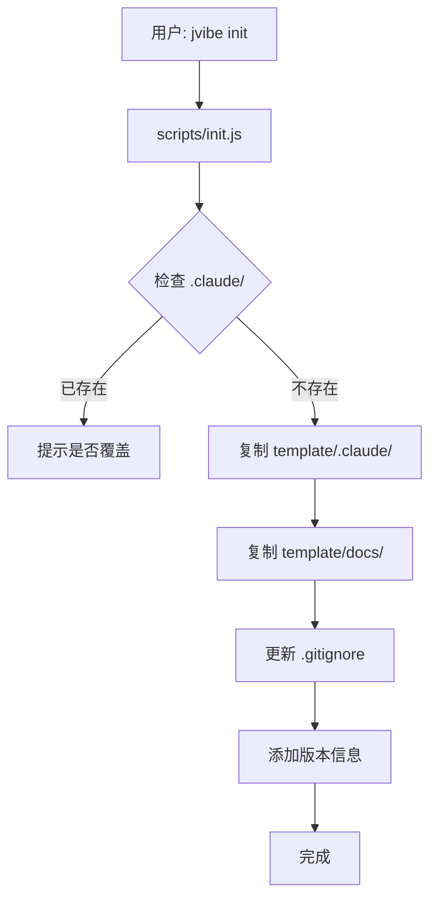

# JVibe 架构说明

本文档详细说明 JVibe 的架构设计、核心组件和工作原理。

---

## 整体架构

JVibe 采用**双层架构**：

```
┌─────────────────────────────────────┐
│          CLI 工具层（外层）         │
│  - npm 包                           │
│  - bin/jvibe.js（入口）             │
│  - scripts/（管理脚本）             │
│  - JVIBE.md（AI 入口）              │
└─────────────────────────────────────┘
              ↓  复制到用户项目
┌─────────────────────────────────────┐
│        项目模板层（内层）           │
│  - template/.claude/                │
│  - template/docs/core/              │
│  - template/docs/project/           │
└─────────────────────────────────────┘
```

---

## 核心组件

### 1. CLI 工具（外层）

#### bin/jvibe.js
CLI 入口，使用 Commander.js 解析命令。

```javascript
jvibe init      → scripts/init.js
jvibe upgrade   → scripts/upgrade.js
jvibe status    → scripts/status.js
jvibe validate  → scripts/validate.js
```

#### scripts/
具体的命令实现。

| 脚本 | 职责 |
|------|------|
| `init.js` | 复制 template/ 到项目，更新 .gitignore |
| `upgrade.js` | 更新 agents/commands/hooks，保留用户配置 |
| `status.js` | 读取配置，显示状态 |
| `validate.js` | 检查配置完整性 |

#### JVIBE.md
AI 入口文档，告诉 Claude Code 如何使用 JVibe。

---

### 2. 项目模板（内层）

#### template/.claude/

Claude Code 的核心配置目录。

**agents/**：4 个 Sub-Agents

| Agent | 职责 | 工具 | 模型 |
|-------|------|------|------|
| planner | 需求分析、功能拆解 | Read, Edit, Grep, Glob | Sonnet |
| developer | 代码实现、TODO 完成 | Read, Write, Edit, Bash | Sonnet |
| reviewer | 代码审查、PR 生成 | Read, Grep, Glob, Bash | Sonnet |
| doc-sync | 状态推导、统计更新 | Read, Edit, Grep, Glob | Haiku |

**commands/**：3 个 JVibe Skills

| Skill | 功能 |
|-------|------|
| JVibe:init | 初始化项目文档，询问项目信息 |
| JVibe:pr | 生成 PR 描述 |
| JVibe:status | 查看功能状态和进度 |

**hooks/**：4 个自动化 Hooks

| Hook | 触发时机 | 功能 |
|------|----------|------|
| load-context.sh | SessionStart | 加载项目上下文 |
| sync-feature-status.sh | PostToolUse（Edit/Write） | 自动推导功能状态 |
| guard-output.sh | Stop | 过长输出提示结构化代码块 |
| sync-stats.sh | Stop | 输出统计信息 |

**settings.json**：Hooks 配置

```json
{
  "hooks": {
    "SessionStart": [...],
    "PostToolUse": [...],
    "Stop": [...]
  },
  "jvibe": {
    "version": "1.0.0",
    "mode": "full"
  }
}
```

#### template/docs/

**core/**：CORE-DOCS（4个固定核心文档）

| 文档 | 职责 |
|------|------|
| Standards.md | 入口与索引、文档导航 |
| Project.md | 架构与模块边界、技术栈 |
| Feature-List.md | 功能状态 SoT（单一事实来源） |
| Appendix.md | 规范索引、编码规范、技术细节 |

**project/**：PROJECT-DOCS（按需创建）

- `README.md` - 说明如何创建 PROJECT-DOCS
- `api.md.example` - API 文档示例
- `database.md.example` - 数据库文档示例

**.jvibe/tasks.yaml**：结构化任务交接文件（单文件协作）

- 记录模块协作的输入/输出/状态
- `active` 保留进行中/待办任务，完成任务移入 `archive`

---

## 工作流程

### 初始化流程



### 开发流程


### 状态推导机制

功能状态由 Hook 自动推导：

```
sync-feature-status.sh（PostToolUse）
  ↓
检测Feature-List.md 是否被修改
  ↓
解析 TODO 完成情况
  ↓
计算完成比例
  ↓
推导状态符号（❌/🚧/✅）
  ↓
更新Project.md 中的状态
```

**状态推导规则**：

```
TODO 完成情况 → 功能状态
┌─────────────────────────────────────┐
│  完成数 / 总数  │  推导状态  │  状态符号   │
├─────────────────┼────────────┼─────────────┤
│     0 / N       │   未开始   │     ❌      │
│   1~(N-1) / N   │   开发中   │     🚧      │
│     N / N       │   已完成   │     ✅      │
└─────────────────────────────────────────────┘
```

---

## 设计原则

### SOLID 原则

| 原则 | 在 JVibe 中的体现 |
|------|------------------|
| **S** 单一职责 | 每个 Agent 只负责一项任务 |
| **O** 开闭原则 | Hooks 和 Skills 可扩展 |
| **L** 里氏替换 | Agent 可以替换为兼容实现 |
| **I** 接口隔离 | 每个 Agent 只暴露必要的工具 |
| **D** 依赖倒置 | Hook 脚本独立于具体实现 |

### DRY 原则

**单一事实来源（SoT）**：
- 功能状态**只在**Feature-List.md 中维护
- Project.md 中的状态通过 Hook **自动推导**
- 避免了双向同步的复杂性

### KISS 原则

**简单的状态推导规则**：
- 只需要计算 TODO 完成比例
- 3 种状态符号（❌/🚧/✅）
- 自动化执行，无需手动维护

### YAGNI 原则

**只实现当前需要的功能**：
- 不预设复杂的工作流
- 文档按需创建（PROJECT-DOCS）
- CLI 命令精简（4 个核心命令）

---

## 技术选型

| 组件 | 技术 | 原因 |
|------|------|------|
| CLI 框架 | Commander.js | 标准、轻量、易用 |
| 文件操作 | fs-extra | 丰富的文件操作 API |
| 终端输出 | chalk | 彩色输出，提升体验 |
| Shell 脚本 | Bash | 跨平台、易于调试 |

---

## 扩展性

### 添加新的 Agent

1. 在 `template/.claude/agents/` 创建新的 `.md` 文件
2. 定义 Agent 的职责和工具
3. 更新 `JVIBE.md` 中的说明

### 添加新的 Skill

1. 在 `template/.claude/commands/` 创建新的 `.md` 文件
2. 使用 YAML front matter 定义 name 和 description
3. 编写 Skill 的具体逻辑

### 添加新的 Hook

1. 在 `template/.claude/hooks/` 创建新的 `.sh` 脚本
2. 在 `settings.json` 中注册 Hook
3. 添加执行权限

---

## 安全考虑

### 权限管理

- Hook 脚本需要执行权限（`chmod +x`）
- 通过 `validate` 命令检查权限

### 数据隔离

- `settings.local.json` 不提交到 Git
- 敏感配置由用户自行管理

### 版本控制

- 通过 `jvibe.version` 字段跟踪版本
- 升级时备份配置到 `.claude-backup/`

---

## 性能优化

### 轻量级 Agent

- `doc-sync` 使用 Haiku 模型（更快、更便宜）
- 其他 Agent 使用 Sonnet（平衡性能和成本）

### 按需加载

- `docs/project/` 示例文件带 `.example` 后缀
- 只在需要时复制和使用

### 最小化依赖

- 只依赖 3 个 npm 包
- 无 devDependencies

---

## 相关文档

- [CLI 命令参考](CLI_COMMANDS.md)
- [CORE vs PROJECT 文档](CORE_VS_PROJECT_DOCS.md)
- [贡献指南](CONTRIBUTING.md)
