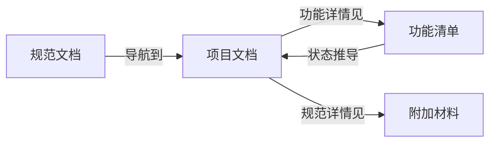

# CORE-DOCS vs PROJECT-DOCS

本文档详细说明 JVibe 文档体系中两种文档类型的区别和使用方式。

---

## 概述

JVibe 使用两类文档组织项目知识：

| 类型 | 位置 | 数量 | 说明 |
|------|------|------|------|
| **CORE-DOCS** | `docs/core/` | 固定 4 个 | 所有项目结构相同 |
| **PROJECT-DOCS** | `docs/project/` | 可变（0~N） | 根据项目类型按需创建 |

---

## CORE-DOCS（核心文档）

### 定义

CORE-DOCS 是文档体系的**基础框架**，在所有项目中**结构相同**。

### 4 个核心文档

| 文档 | 职责 | 内容 |
|------|------|------|
| **规范文档.md** | 入口与索引 | 文档导航、开发流程、使用规则 |
| **项目文档.md** | 架构与模块边界 | 技术栈、模块清单、功能索引 |
| **功能清单.md** | 功能状态 SoT | 每个功能的描述 + TODO + 状态 |
| **附加材料.md** | 规范索引 | 编码规范、技术细节、用户偏好 |

### 特点

- ✅ **必须存在**：4 个文档缺一不可
- ✅ **结构固定**：章节结构在所有项目中相同
- ✅ **内容可变**：技术栈、模块、功能等内容根据项目填充
- ✅ **无需注册**：核心文档自动存在

### 文档间关系



---

## PROJECT-DOCS（项目文档）

### 定义

PROJECT-DOCS 是根据项目类型**按需创建**的技术文档。

### 常见类型

**后端项目**：
- API 文档（REST/GraphQL 端点）
- 数据库 Schema 文档
- 部署文档

**前端项目**：
- 组件文档（Storybook 等）
- 路由文档
- 状态管理文档

**其他**：
- 第三方集成文档
- 性能优化文档
- 安全审计文档

### 特点

- ✅ **数量可变**：0~N 个，根据需要创建
- ✅ **结构灵活**：每个文档结构可以不同
- ⚠️ **必须注册**：在规范文档的「Project文档注册表」中登记

### 注册机制

所有 PROJECT-DOCS 必须在 `规范文档.md` 中注册：

```markdown
## 2.2.1 Project文档注册表

> ⚠️ 所有Project文档必须在此注册，否则视为无效文档

| 文档ID | 文档名称 | 位置 | 用途 | 维护者 | 状态 |
|--------|----------|------|------|--------|------|
| P-001  | API文档  | `docs/project/api.md` | REST API端点 | 后端 | active |
| P-002  | 数据库Schema | `docs/project/database.md` | 表结构和ER图 | 后端 | active |
```

---

## 单一事实来源（SoT）

**重要**：功能状态只在 `功能清单.md` 中维护！

### 状态推导规则

```
TODO 完成情况 → 功能状态
┌─────────────────────────────────────┐
│  完成数 / 总数  │  推导状态  │  状态符号   │
├─────────────────┼────────────┼─────────────┤
│     0 / N       │   未开始   │     ❌      │
│   1~(N-1) / N   │   开发中   │     🚧      │
│     N / N       │   已完成   │     ✅      │
└─────────────────────────────────────────────┘
```

### 为什么使用 SoT？

- **避免双向同步**：不需要在多处更新状态
- **减少不一致**：单一来源，没有冲突
- **自动化友好**：Hooks 可以自动推导状态

---

## 最佳实践

### 创建 PROJECT-DOCS 的步骤

1. 在 `docs/project/` 创建文档
2. 在文档开头说明：是什么、怎么用、更新时机
3. 在 `规范文档.md` 的注册表中添加记录

### 常见错误

❌ **错误**：创建 PROJECT-DOCS 但不注册
❌ **错误**：在项目文档中维护功能状态
❌ **错误**：修改 CORE-DOCS 的章节结构

✅ **正确**：所有 PROJECT-DOCS 都已注册
✅ **正确**：功能状态只在功能清单中更新
✅ **正确**：CORE-DOCS 结构保持不变，只修改内容
