# JVibe 项目模板

> 文档驱动的 AI 辅助开发系统

---

## 📌 这是什么？

这是由 JVibe CLI 工具初始化的项目模板，包含：

- **`.claude/`** - Claude Code 配置（Agents、Commands、Hooks）
- **`.opencode/`** - OpenCode 配置（Agents、Commands）
- **`docs/core/`** - 4 个核心文档（CORE-DOCS）
- **`docs/project/`** - 项目特定文档（PROJECT-DOCS）

---

## 🚀 快速开始

### 1. 初始化项目文档

```bash
# 使用 JVibe 命令初始化
/JVibe:init

# 在 OpenCode 中运行
/jvibe-init
```

这会：
- 询问项目名称、技术栈、初始模块
- 填充 `docs/core/` 中的 4 个核心文档

### 2. 查看项目状态

```bash
/JVibe:status

/jvibe-status
```

### 3. 开始开发

使用自然语言描述你的需求：

```
"添加用户登录功能"
```

JVibe 会自动：
1. 调用 `planner` agent 分析需求、创建功能条目
2. 调用 `developer` agent 实现代码
3. 调用 `tester` agent 进行测试验证
4. 调用 `reviewer` agent 审查代码
5. 自动同步文档状态

---

## 📂 目录结构

```
your-project/
├── .claude/                    # Claude Code 配置（可选）
│   ├── agents/                 # 5 个 Sub-Agents
│   │   ├── planner.md         # 需求规划
│   │   ├── developer.md       # 代码开发
│   │   ├── tester.md          # 测试验证
│   │   ├── reviewer.md        # 代码审查
│   │   └── doc-sync.md        # 文档同步
│   ├── commands/               # 5 个 JVibe Skills
│   │   ├── JVibe:init.md      # 初始化
│   │   ├── JVibe:keepgo.md    # 自动推进
│   │   ├── JVibe:migrate.md   # 智能迁移
│   │   ├── JVibe:pr.md        # PR 生成
│   │   └── JVibe:status.md    # 状态查看
│   ├── hooks/                  # 4 个自动化 Hooks
│   │   ├── load-context.sh
│   │   ├── sync-feature-status.sh
│   │   ├── guard-output.sh
│   │   └── sync-stats.sh
│   └── settings.json
│
├── .opencode/                  # OpenCode 配置（可选）
│   ├── agent/                  # 5 个 Sub-Agents
│   ├── command/                # 5 个 JVibe Commands
│   │   ├── jvibe-init.md       # 初始化
│   │   ├── jvibe-keepgo.md     # 自动推进
│   │   ├── jvibe-migrate.md    # 智能迁移
│   │   ├── jvibe-pr.md         # PR 生成
│   │   └── jvibe-status.md     # 状态查看
│   ├── permissions.yaml        # 权限矩阵
│   ├── error-handling.md       # 错误处理策略
│   ├── instructions.md         # OpenCode 启动指令
│   └── opencode.jsonc
│
├── docs/
│   ├── core/                   # ⭐️ CORE-DOCS（4个固定核心文档）
│   │   ├── Standards.md        # 入口和索引
│   │   ├── Project.md        # 架构与模块边界
│   │   ├── Feature-List.md        # 功能状态唯一来源（SoT）
│   │   └── Appendix.md        # 规范索引
│   ├── .jvibe/                 # 任务交接文件
│   │   └── tasks.yaml          # 单文件协作入口
│   │
│   └── project/                # ⭐️ PROJECT-DOCS（按需创建）
│       ├── README.md           # 说明文档
│       ├── api.md.example      # API文档示例
│       └── database.md.example # 数据库文档示例
│
└── .gitignore
```

---

## 📚 文档体系

### CORE-DOCS（核心文档）

| 文档 | 职责 | 说明 |
|------|------|------|
| **规范文档** | 入口与索引 | 文档导航、开发流程、使用规则 |
| **项目文档** | 架构与模块边界 | 技术栈、模块清单、功能索引 |
| **功能清单** | 功能状态 SoT | 每个功能的描述 + TODO + 状态 |
| **附加材料** | 规范索引 | 编码规范、技术细节、用户偏好 |

### PROJECT-DOCS（项目文档）

根据项目类型按需创建，例如：
- API 文档
- 数据库 Schema 文档
- 部署文档
- 组件文档

⚠️ **所有 PROJECT-DOCS 必须在规范文档中注册**

---

## 🤖 JVibe 工作流

```mermaid
graph LR
    A[需求分析] --> B[功能拆解]
    B --> C[技术设计]
    C --> D[编码实现]
    D --> E[代码审查]
    E --> F[文档同步]
```



### 核心原则

- **Doc-driven**：文档驱动开发
- **SoT**：功能状态只在功能清单中维护（单一事实来源）
- **AI-native**：专为 AI 辅助开发设计的工作流

---

## 📋 常用命令

| 命令 | 说明 |
|------|------|
| `/JVibe:init` / `/jvibe-init` | 初始化项目文档 |
| `/JVibe:status` / `/jvibe-status` | 查看项目状态和进度 |
| `/JVibe:pr` / `/jvibe-pr` | 生成标准化 PR 描述 |

---

## 🔗 相关链接

- [JVibe CLI 文档](https://github.com/your-org/jvibe)
- [Claude Code 官方文档](https://docs.anthropic.com/claude-code)
- [OpenCode 官方文档](https://opencode.ai/docs)
