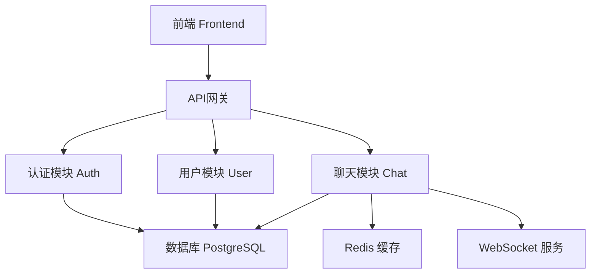
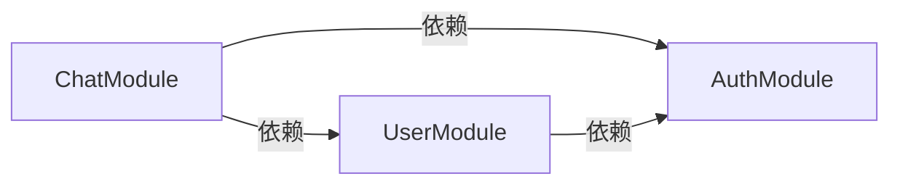
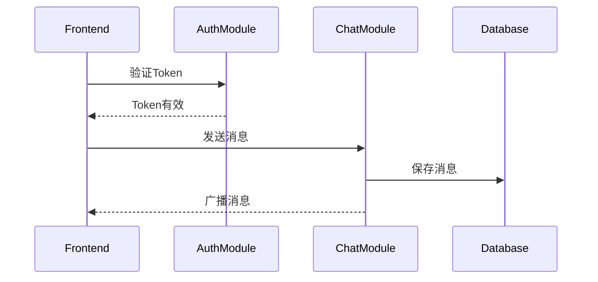

# [项目名称] 项目文档

> 最后更新: YYYY-MM-DD | 版本: v2.0

## 📌 文档说明

本文档帮助AI Agent快速理解：
1. 项目整体架构
2. 有哪些模块及其职责边界
3. 每个模块的代码落点和功能索引

**功能详细信息及状态**: 查看 [功能清单](./功能清单.md)（功能状态的唯一来源）

---

## 1. 项目架构图



---

## 2. 技术栈版本

| 分类 | 技术 | 版本 |
|------|------|------|
| **前端** | React | 18.2.0 |
| | TypeScript | 5.3.0 |
| | Vite | 5.0.0 |
| **后端** | Node.js | 20.10.0 |
| | Express | 4.18.2 |
| | Prisma | 5.8.0 |
| **数据库** | PostgreSQL | 15.5 |
| | Redis | 7.2.0 |
| **其他** | JWT | - |
| | Socket.io | 4.6.0 |

---

## 3. 模块交互图

### 3.1 依赖关系



### 3.2 数据流



---

## 4. 模块清单

### 4.1 AuthModule (认证模块)

**职责/边界**：
- 处理用户身份认证（注册、登录、Token管理）
- 提供认证中间件供其他模块使用
- 不包含用户资料管理（由UserModule负责）

**对外接口**：
| 端点 | 方法 | 用途 |
|------|------|------|
| `/api/auth/register` | POST | 用户注册 |
| `/api/auth/login` | POST | 用户登录 |
| `/api/auth/refresh` | POST | 刷新Token |
| `/api/auth/logout` | POST | 用户登出 |

**数据模型**：
| 表名 | 主要字段 | 关键索引 |
|------|---------|---------|
| `users` | id, email, password_hash | email (UNIQUE) |
| `auth_tokens` | id, user_id, token, expires_at | user_id, token |

**代码落点**：
```
src/modules/auth/
├── auth.controller.ts   # 路由控制器
├── auth.service.ts      # 业务逻辑
├── auth.middleware.ts   # 认证中间件
└── jwt.util.ts          # JWT工具函数
```

**功能索引**：
| 功能编号 | 功能名称 | 详情 |
|---------|---------|------|
| F-001 | 用户注册 | [查看](./功能清单.md#f-001-用户注册) |
| F-002 | 用户登录 | [查看](./功能清单.md#f-002-用户登录) |
| F-003 | Token刷新 | [查看](./功能清单.md#f-003-token刷新) |
| F-004 | 密码重置 | [查看](./功能清单.md#f-004-密码重置) |
| F-005 | 邮箱验证 | [查看](./功能清单.md#f-005-邮箱验证) |

**依赖**: 无
**被依赖**: UserModule, ChatModule

---

### 4.2 UserModule (用户管理模块)

**职责/边界**：
- 管理用户资料（查询、编辑、头像）
- 提供用户搜索功能
- 不包含身份认证（由AuthModule负责）

**对外接口**：
| 端点 | 方法 | 用途 |
|------|------|------|
| `/api/users/:id` | GET | 获取用户信息 |
| `/api/users/:id` | PUT | 更新用户资料 |
| `/api/users/:id/avatar` | POST | 上传头像 |
| `/api/users/search` | GET | 搜索用户 |
| `/api/users/:id` | DELETE | 删除用户 |

**数据模型**：
| 表名 | 主要字段 | 关键索引 |
|------|---------|---------|
| `user_profiles` | id, user_id, display_name, avatar_url | user_id (FK) |

**代码落点**：
```
src/modules/user/
├── user.controller.ts   # 路由控制器
├── user.service.ts      # 业务逻辑
└── user.repository.ts   # 数据访问层
```

**功能索引**：
| 功能编号 | 功能名称 | 详情 |
|---------|---------|------|
| F-006 | 用户信息查询 | [查看](./功能清单.md#f-006-用户信息查询) |
| F-007 | 用户资料编辑 | [查看](./功能清单.md#f-007-用户资料编辑) |
| F-008 | 头像上传 | [查看](./功能清单.md#f-008-头像上传) |
| F-009 | 用户搜索 | [查看](./功能清单.md#f-009-用户搜索) |
| F-010 | 用户权限管理 | [查看](./功能清单.md#f-010-用户权限管理) |

**依赖**: AuthModule
**被依赖**: ChatModule

---

### 4.3 ChatModule (实时聊天模块)

**职责/边界**：
- 管理聊天室（创建、加入、离开）
- 处理消息收发（文本、文件）
- 维护用户在线状态
- 不包含用户认证和资料管理

**对外接口**：
| 端点 | 方法/协议 | 用途 |
|------|----------|------|
| `/api/chat/rooms` | POST | 创建聊天室 |
| `/api/chat/rooms` | GET | 获取聊天室列表 |
| `/api/chat/messages/:roomId` | GET | 获取历史消息 |
| `/api/chat/rooms/:id/join` | POST | 加入聊天室 |
| `/ws/chat` | WebSocket | 实时消息通信 |

**数据模型**：
| 表名 | 主要字段 | 关键索引 |
|------|---------|---------|
| `chat_rooms` | id, name, type, created_at | name |
| `messages` | id, room_id, sender_id, content, sent_at | room_id, sender_id, sent_at |
| `room_members` | id, room_id, user_id, joined_at | room_id, user_id |

**代码落点**：
```
src/modules/chat/
├── chat.controller.ts      # 路由控制器
├── chat.service.ts         # 业务逻辑
├── websocket.gateway.ts    # WebSocket处理
└── message.repository.ts   # 消息数据访问
```

**功能索引**：
| 功能编号 | 功能名称 | 详情 |
|---------|---------|------|
| F-011 | 创建聊天室 | [查看](./功能清单.md#f-011-创建聊天室) |
| F-012 | 发送文本消息 | [查看](./功能清单.md#f-012-发送文本消息) |
| F-013 | 接收实时消息 | [查看](./功能清单.md#f-013-接收实时消息) |
| F-014 | 历史消息查询 | [查看](./功能清单.md#f-014-历史消息查询) |
| F-015 | 在线状态显示 | [查看](./功能清单.md#f-015-在线状态显示) |
| F-016 | 输入状态指示 | [查看](./功能清单.md#f-016-输入状态指示) |
| F-017 | 消息通知 | [查看](./功能清单.md#f-017-消息通知) |
| F-018 | 文件分享 | [查看](./功能清单.md#f-018-文件分享) |
| F-019 | 消息搜索 | [查看](./功能清单.md#f-019-消息搜索) |
| F-020 | 消息已读状态 | [查看](./功能清单.md#f-020-消息已读状态) |

**依赖**: UserModule, AuthModule
**被依赖**: 无

---

## 5. 模块功能统计

> ⚠️ **数据来源**：以 [功能清单](./功能清单.md) 中的状态为准，本表按 sprint/里程碑周期性更新。

| 模块 | 功能总数 | 已完成 | 开发中 | 未开始 | 完成率 |
|------|---------|--------|--------|--------|--------|
| AuthModule | 5 | 5 | 0 | 0 | 100% |
| UserModule | 5 | 5 | 0 | 0 | 100% |
| ChatModule | 10 | 7 | 1 | 2 | 70% |
| **总计** | **20** | **17** | **1** | **2** | **85%** |

**状态图例**（定义见功能清单）：
- ✅ 已完成: 功能开发完成、测试通过、已合并
- 🚧 开发中: 正在开发中
- ❌ 未开始: 已规划但未开始

---

## 6. 数据库表总览

| 表名 | 所属模块 | 主要字段 | 关键索引 |
|------|---------|---------|---------|
| users | AuthModule | id, email, password_hash | email (UNIQUE) |
| auth_tokens | AuthModule | id, user_id, token, expires_at | user_id, token |
| user_profiles | UserModule | id, user_id, display_name, avatar_url | user_id (FK) |
| chat_rooms | ChatModule | id, name, type, created_at | name |
| messages | ChatModule | id, room_id, sender_id, content, sent_at | room_id, sender_id, sent_at |
| room_members | ChatModule | id, room_id, user_id, joined_at | room_id, user_id |

---

## 📋 附录

### 相关文档
- [功能清单](./功能清单.md) - 每个功能的详细描述和TODO（状态唯一来源）
- [附加材料](./附加材料.md) - 编码规范、技术标准
- [规范文档](./规范文档.md) - 文档体系入口

### 文档维护规则
1. 新增模块时，必须在本文档中添加对应章节
2. **功能状态以功能清单为准**，本文档不单独维护状态
3. 技术栈版本变更时及时更新
4. 每次架构调整需更新架构图和交互图
5. 统计数据按 sprint/里程碑周期性从功能清单推导

### 变更记录

#### v2.0 (YYYY-MM-DD)
- **重大变更**：功能索引不再包含状态列，状态以功能清单为准
- **优化**：模块章节结构标准化（职责/边界、接口、数据模型、代码落点、功能索引）
- **优化**：统计表标注数据来源和更新周期
- **优化**：相关文档链接改为相对路径

#### v1.0 (YYYY-MM-DD)
- 初始化项目文档
- 定义模块清单和功能状态

---

**最后更新**: YYYY-MM-DD
**文档版本**: v2.0
