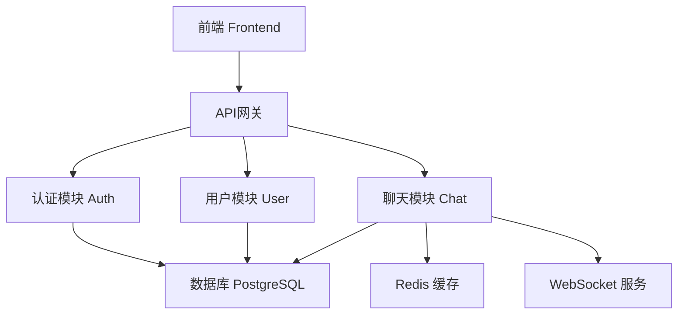
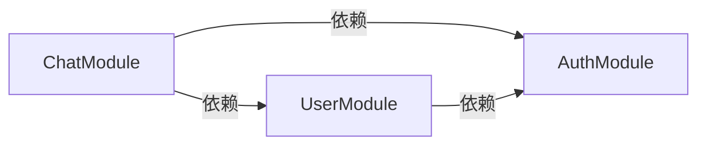
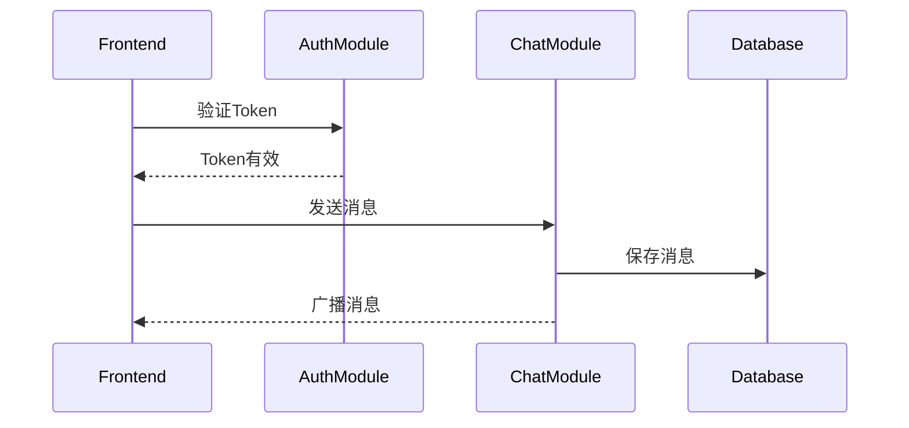

# [项目名称] 项目文档

> 最后更新: YYYY-MM-DD

## 📌 文档说明

本文档帮助AI Agent快速理解：
1. 项目整体架构
2. 有哪些模块
3. 每个模块有哪些功能及其完成状态

**功能详细信息**: 查看 [功能清单文档](./功能清单.md)

---

## 1. 项目架构图

---

## 2. 技术栈版本

| 分类 | 技术 | 版本 |
|------|------|------|
| **前端** | React | 18.2.0 |
| | TypeScript | 5.3.0 |
| | Vite | 5.0.0 |
| **后端** | Node.js | 20.10.0 |
| | Express | 4.18.2 |
| | Prisma | 5.8.0 |
| **数据库** | PostgreSQL | 15.5 |
| | Redis | 7.2.0 |
| **其他** | JWT | - |
| | Socket.io | 4.6.0 |

---

## 3. 模块交互图

### 3.1 依赖关系

### 3.2 数据流

---

## 4. 模块清单

### 4.1 AuthModule (认证模块)

**位置**: `src/modules/auth/`

**核心文件**:
- `auth.controller.ts` - 路由控制器
- `auth.service.ts` - 业务逻辑
- `auth.middleware.ts` - 认证中间件
- `jwt.util.ts` - JWT工具函数

**核心函数**:
- `register(email, password)` - 用户注册
- `login(email, password)` - 用户登录
- `refreshToken(refreshToken)` - 刷新Token
- `verifyToken(token)` - 验证Token
- `resetPassword(email)` - 密码重置

**API端点**:
- `POST /api/auth/register`
- `POST /api/auth/login`
- `POST /api/auth/refresh`
- `POST /api/auth/logout`

**数据库表**: `users`, `auth_tokens`

**依赖**: 无
**被依赖**: UserModule, ChatModule

**功能列表**:
| 功能编号 | 功能名称 | 状态 |
|---------|---------|------|
| F-001 | 用户注册 | ✅ 已完成 |
| F-002 | 用户登录 | ✅ 已完成 |
| F-003 | Token刷新 | ✅ 已完成 |
| F-004 | 密码重置 | ✅ 已完成 |
| F-005 | 邮箱验证 | ✅ 已完成 |

> 详细信息见 [功能清单](./功能清单.md) 对应条目

---

### 4.2 UserModule (用户管理模块)

**位置**: `src/modules/user/`

**核心文件**:
- `user.controller.ts` - 路由控制器
- `user.service.ts` - 业务逻辑
- `user.repository.ts` - 数据访问层

**核心函数**:
- `getUserById(userId)` - 获取用户信息
- `updateProfile(userId, data)` - 更新资料
- `uploadAvatar(userId, file)` - 上传头像
- `searchUsers(query)` - 搜索用户
- `deleteUser(userId)` - 删除用户

**API端点**:
- `GET /api/users/:id`
- `PUT /api/users/:id`
- `POST /api/users/:id/avatar`
- `GET /api/users/search`
- `DELETE /api/users/:id`

**数据库表**: `user_profiles`

**依赖**: AuthModule
**被依赖**: ChatModule

**功能列表**:
| 功能编号 | 功能名称 | 状态 |
|---------|---------|------|
| F-006 | 用户信息查询 | ✅ 已完成 |
| F-007 | 用户资料编辑 | ✅ 已完成 |
| F-008 | 头像上传 | ✅ 已完成 |
| F-009 | 用户搜索 | ✅ 已完成 |
| F-010 | 用户权限管理 | ✅ 已完成 |

> 详细信息见 [功能清单](./功能清单.md) 对应条目

---

### 4.3 ChatModule (实时聊天模块)

**位置**: `src/modules/chat/`

**核心文件**:
- `chat.controller.ts` - 路由控制器
- `chat.service.ts` - 业务逻辑
- `websocket.gateway.ts` - WebSocket处理
- `message.repository.ts` - 消息数据访问

**核心函数**:
- `createRoom(name, members)` - 创建聊天室
- `sendMessage(roomId, content)` - 发送消息
- `getMessages(roomId, pagination)` - 获取历史消息
- `joinRoom(userId, roomId)` - 加入聊天室
- `leaveRoom(userId, roomId)` - 离开聊天室
- `updateOnlineStatus(userId, status)` - 更新在线状态

**API端点**:
- `POST /api/chat/rooms`
- `GET /api/chat/rooms`
- `GET /api/chat/messages/:roomId`
- `POST /api/chat/rooms/:id/join`
- `WebSocket /ws/chat`

**数据库表**: `chat_rooms`, `messages`, `room_members`

**依赖**: UserModule, AuthModule
**被依赖**: 无

**功能列表**:
| 功能编号 | 功能名称 | 状态 |
|---------|---------|------|
| F-011 | 创建聊天室 | ✅ 已完成 |
| F-012 | 发送文本消息 | ✅ 已完成 |
| F-013 | 接收实时消息 | ✅ 已完成 |
| F-014 | 历史消息查询 | ✅ 已完成 |
| F-015 | 在线状态显示 | ✅ 已完成 |
| F-016 | 输入状态指示 | ✅ 已完成 |
| F-017 | 消息通知 | ✅ 已完成 |
| F-018 | 文件分享 | 🚧 开发中 |
| F-019 | 消息搜索 | ❌ 未开始 |
| F-020 | 消息已读状态 | ❌ 未开始 |

> 详细信息见 [功能清单](./功能清单.md) 对应条目

---

## 5. 模块功能总览

| 模块 | 功能总数 | 已完成 | 开发中 | 未开始 | 完成率 |
|------|---------|--------|--------|--------|--------|
| AuthModule | 5 | 5 | 0 | 0 | 100% |
| UserModule | 5 | 5 | 0 | 0 | 100% |
| ChatModule | 10 | 7 | 1 | 2 | 70% |
| **总计** | **20** | **17** | **1** | **2** | **85%** |

**状态图例**:
- ✅ 已完成: 功能开发完成、测试通过、已合并
- 🚧 开发中: 正在开发中
- ❌ 未开始: 已规划但未开始

---

## 6. 数据库表总览

| 表名 | 所属模块 | 主要字段 | 关键索引 |
|------|---------|---------|---------|
| users | AuthModule | id, email, password_hash | email (UNIQUE) |
| auth_tokens | AuthModule | id, user_id, token, expires_at | user_id, token |
| user_profiles | UserModule | id, user_id, display_name, avatar_url | user_id (FK) |
| chat_rooms | ChatModule | id, name, type, created_at | name |
| messages | ChatModule | id, room_id, sender_id, content, sent_at | room_id, sender_id, sent_at |
| room_members | ChatModule | id, room_id, user_id, joined_at | room_id, user_id |

---

## 📋 附录

### 相关文档
- [功能清单](./功能清单.md) - 每个功能的详细描述和TODO
- [需求评审决策树](./01-需求评审决策树.md)
- [核心开发流程](./02-核心开发流程.md)
- [附加材料](./附加材料/) - 编码规范、技术标准

### 文档维护规则
1. 新增模块时，必须在本文档中添加对应章节
2. 功能状态与功能清单文档保持同步
3. 技术栈版本变更时及时更新
4. 每次架构调整需更新架构图和交互图

---

**最后更新**: YYYY-MM-DD
**文档版本**: v1.0
