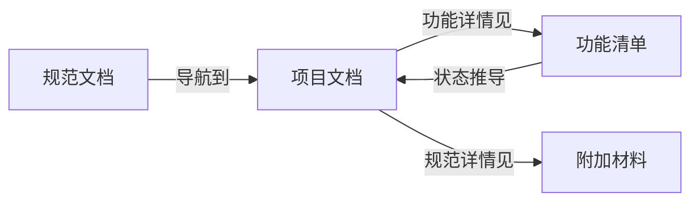

# [项目名称] 规范文档

> 最后更新: YYYY-MM-DD | 版本: v2.0

## 📌 文档定位

本文档是项目文档体系的**入口和索引**，帮助AI Agent和开发者：

1. 快速定位所需文档
2. 理解开发流程
3. 掌握文档使用和维护规则

**阅读顺序**：规范文档 → 项目文档 → 功能清单 → 按需查阅其他文档

------

## 1. 快速导航

### 1.1 我想...

| 我想...                | 查看文档                         | 具体章节            |
| ---------------------- | -------------------------------- | ------------------- |
| 了解项目整体架构       | [项目文档](./项目文档.md)        | §1 项目架构图       |
| 查看某个模块有哪些功能 | [项目文档](./项目文档.md)        | §4 模块清单         |
| 开发某个功能的具体TODO | [功能清单](./功能清单.md)        | 按 F-XXX 编号查找   |
| 查阅编码规范/技术标准  | [附加材料](./附加材料.md)        | 按条目 ID 查找      |
| 调用某个API            | [API文档](./docs/api.md)         | -                   |

### 1.2 文档状态总览

| 文档     | 类型    | 状态       | 最后更新   |
| -------- | ------- | ---------- | ---------- |
| 规范文档 | Core    | ✅ 已完成   | YYYY-MM-DD |
| 项目文档 | Core    | ✅ 已完成   | YYYY-MM-DD |
| 功能清单 | Core    | 🔄 持续更新 | YYYY-MM-DD |
| 附加材料 | Core    | 🔄 持续更新 | YYYY-MM-DD |
| API文档  | Project | ✅ 已完成   | YYYY-MM-DD |

------

## 2. 文档体系

```
📁 docs/
├── 📄 规范文档.md      ← 你在这里（入口）
├── 📄 项目文档.md      ← 架构 + 模块 + 功能索引
├── 📄 功能清单.md      ← 功能详情 + TODO（状态唯一来源）
├── 📄 附加材料.md      ← 规范索引 + 技术细节
└── 📁 project/         ← 项目特定文档
    ├── api.md
    ├── database.md
    └── ...
```

### 2.1 Core文档（固定结构）

Core文档在所有项目中**结构相同**，是文档体系的基础框架。

| 文档         | 职责（单一）         | 核心内容                           |
| ------------ | -------------------- | ---------------------------------- |
| **规范文档** | 入口与索引           | 文档导航、开发流程、使用规则       |
| **项目文档** | 架构与模块边界       | 技术栈、模块清单、功能索引（不含状态） |
| **功能清单** | 功能状态唯一来源(SoT) | 每个功能的描述 + 实现TODO + 状态   |
| **附加材料** | 规范索引             | 编码规范、技术细节、用户记忆       |

**文档间关系**：



> ⚠️ **单一事实来源（SoT）原则**：功能状态只在功能清单中维护，项目文档的统计数据由功能清单推导。

### 2.2 Project文档（按需扩展）

Project文档根据项目类型**按需创建**，结构和数量可变。

#### 2.2.1 Project文档注册表

> ⚠️ 所有Project文档必须在此注册，否则视为无效文档

| 文档ID | 文档名称     | 位置               | 用途                 | 维护者 | 状态   |
| ------ | ------------ | ------------------ | -------------------- | ------ | ------ |
| P-001  | API文档      | `docs/api.md`      | 记录所有REST API端点 | 后端   | active |
| P-002  | 数据库Schema | `docs/database.md` | 数据库表结构和ER图   | 后端   | active |
| P-003  | 部署文档     | `docs/deploy.md`   | 部署流程和环境配置   | DevOps | draft  |

#### 2.2.2 常见Project文档类型

根据项目类型选择需要的文档：

**后端项目**：
- [ ] API文档（REST/GraphQL端点）
- [ ] 数据库Schema文档
- [ ] 部署文档

**前端项目**：
- [ ] 组件文档（Storybook等）
- [ ] 路由文档
- [ ] 状态管理文档

**全栈项目**：
- [ ] 以上全部按需选择

**其他**：
- [ ] 第三方集成文档
- [ ] 性能优化文档
- [ ] 安全审计文档

------

## 3. 开发流程

> 💡 根据项目特点配置，以下为示例流程

### 3.1 流程总览


### 3.2 各阶段文档操作

| 阶段         | 输入     | 操作                           | 输出          |
| ------------ | -------- | ------------------------------ | ------------- |
| **需求分析** | 需求描述 | 理解需求范围                   | 需求确认      |
| **功能拆解** | 需求确认 | 在功能清单新增 F-XXX           | 功能条目+TODO |
| **技术设计** | 功能TODO | 查阅附加材料相关规范           | 技术方案      |
| **编码实现** | 技术方案 | 按TODO逐项完成                 | 代码          |
| **测试验证** | 代码     | 执行测试TODO                   | 测试报告      |
| **代码合并** | 测试通过 | 更新功能清单状态为✅            | PR合并        |

### 3.3 功能开发检查清单

开发新功能时，按顺序检查：

- [ ] 在功能清单中创建功能条目（F-XXX）
- [ ] 在项目文档对应模块添加功能索引行（可选）
- [ ] 查阅附加材料相关规范（如有）
- [ ] 完成TODO中的所有任务
- [ ] 更新功能清单状态：❌ → 🚧 → ✅

> ⚠️ **注意**：功能状态只需在功能清单中更新，项目文档的统计数据按 sprint/里程碑周期性推导。

### 3.4 PR 描述引用规范

创建 PR 前，检查是否命中附加材料中的触发条件。如命中，使用以下模板：

```markdown
## 命中规范条目
- [ ] CS-___ : [说明如何满足]
- [ ] API-___ : [说明如何满足]
- [ ] SEC-___ : [说明如何满足]

## 变更说明
...
```

------

## 4. 文档使用规则

### 4.1 规范文档

**是什么**：文档体系的入口和索引

**怎么用**：
- AI Agent首次接触项目时，先读此文档
- 通过"快速导航"定位目标文档
- 了解开发流程和文档规则

**更新时机**：
- 新增/删除Core或Project文档时
- 开发流程调整时
- 文档规则变更时

### 4.2 项目文档

**是什么**：项目架构和模块边界的总览视图

**怎么用**：
- 了解项目技术栈和整体架构
- 查看各模块的职责边界和代码落点
- 通过功能索引跳转到功能清单查看详情

**更新时机**：
- 新增模块时：添加模块章节
- 新增功能时：在对应模块添加功能索引行（可选）
- 技术栈变更时：更新版本表
- 按 sprint/里程碑：更新统计数据

> ⚠️ **注意**：项目文档不维护功能状态，状态以功能清单为准。

### 4.3 功能清单

**是什么**：每个功能的详细描述和开发TODO，**功能状态的唯一来源**

**怎么用**：
- 理解功能的业务目标
- 获取具体的开发任务列表
- 跟踪TODO完成进度
- 更新功能状态

**更新时机**：
- 新增功能时：创建功能条目
- TODO完成时：勾选对应项
- 全部TODO完成时：状态改为✅

**编号规则**：
- 格式：`F-XXX`（F = Feature，XXX = 三位数字）
- 连续编号，不重复使用已删除的编号

### 4.4 附加材料

**是什么**：开发规范、技术细节、用户偏好的索引库

**怎么用**：
- 创建PR前：检查是否命中条目的"触发条件"
- 代码审查时：引用条目ID说明问题
- 技术方案设计时：查阅相关规范

**更新时机**：
- 发现新的规范需求时：添加条目
- 用户强调特定偏好时：添加UM条目
- 外部链接失效时：更新Links字典

**条目ID命名**：

| 分类       | 前缀  | 示例            |
| ---------- | ----- | --------------- |
| 编码规范   | CS-   | CS-001          |
| API设计    | API-  | API-001         |
| 数据库设计 | DB-   | DB-001          |
| 安全检查   | SEC-  | SEC-001         |
| 测试策略   | TEST- | TEST-001        |
| 技术细节   | TD-   | TD-001          |
| 设计风格   | DS-   | DS-001          |
| 用户记忆   | UM-   | UM-20260109-001 |

### 4.5 Project文档

**是什么**：项目特定的技术文档（API、数据库、部署等）

**怎么用**：
- 根据具体需求查阅对应文档
- 通过注册表（§2.2.1）确认文档位置和状态

**更新时机**：
- 由各文档自身定义（见各文档内说明）

**新增Project文档规则**：
1. 在注册表（§2.2.1）添加记录
2. 在文档开头说明：是什么、怎么用、更新时机
3. 通知相关维护者

------

## 5. 文档维护规则

### 5.1 同步规则

| 变更类型        | 需更新的文档                                   |
| --------------- | ---------------------------------------------- |
| 新增模块        | 项目文档（添加模块章节）                       |
| 新增功能        | 功能清单（功能条目）+ 项目文档（功能索引，可选） |
| 功能状态变更    | **仅更新功能清单**                             |
| 统计数据更新    | 项目文档（按 sprint/里程碑从功能清单推导）     |
| 新增规范        | 附加材料（条目）+ 规范文档（如影响流程）       |
| 新增Project文档 | 规范文档（注册表）+ 快速导航（如常用）         |

> ⚠️ **核心原则**：功能状态只在功能清单中维护，避免双向同步的维护成本。

### 5.2 版本控制

- 文档随代码一起提交到Git
- 重大变更在文档末尾记录变更日志
- 使用有意义的commit message：`docs: 更新功能F-018状态`

### 5.3 质量检查

**每次PR前**：
- [ ] 新增功能在功能清单中有完整的TODO列表
- [ ] 命中的附加材料条目已在PR描述中引用
- [ ] Project文档在注册表中有记录

**每月检查**：
- [ ] 附加材料中的外部链接有效性
- [ ] 清理已完成的用户记忆条目
- [ ] 更新文档状态总览

**每 sprint/里程碑**：
- [ ] 从功能清单推导项目文档的统计数据

------

## 📋 附录

### A. 文档模板位置

- [项目文档模板](./模板-项目文档.md)
- [功能清单模板](./模板-功能清单.md)
- [附加材料模板](./模板-附加材料.md)

### B. 变更记录

#### v2.0 (YYYY-MM-DD)
- **重大变更**：确立功能清单为功能状态的唯一来源（SoT）
- **优化**：同步规则从双向改为单向，降低维护成本
- **优化**：快速导航链接改为相对路径
- **新增**：PR描述引用规范模板
- **调整**：项目文档职责聚焦于架构与模块边界

#### v1.0 (YYYY-MM-DD)
- 初始化规范文档
- 定义Core文档和Project文档体系
- 制定开发流程和文档使用规则

------

**最后更新**：YYYY-MM-DD **文档版本**：v2.0 **维护者**：项目负责人
